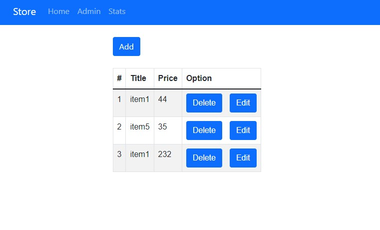
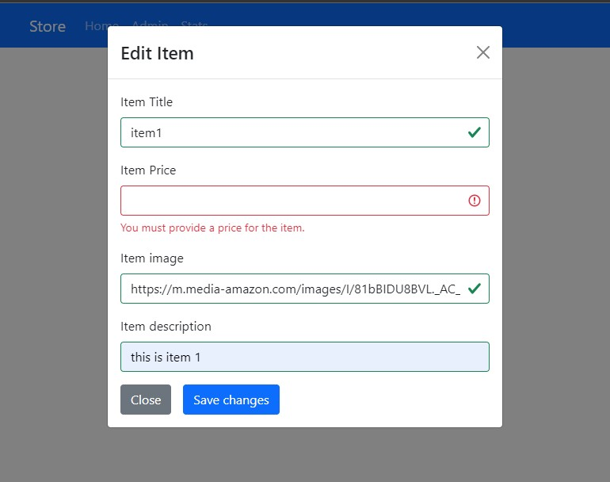
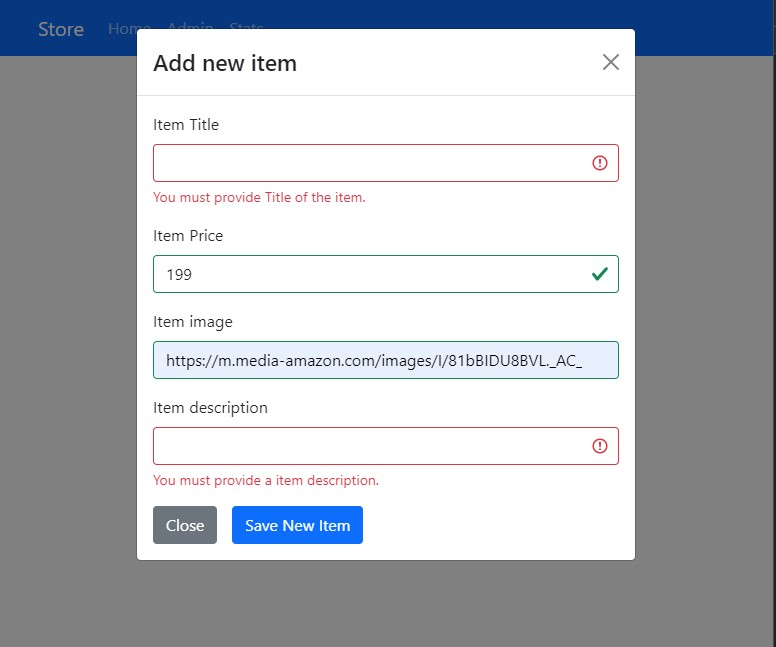
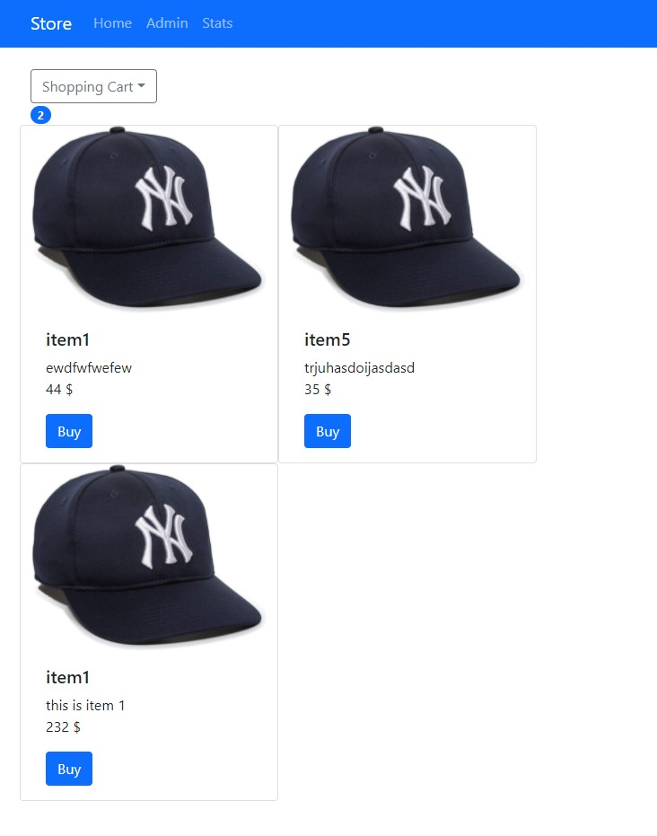
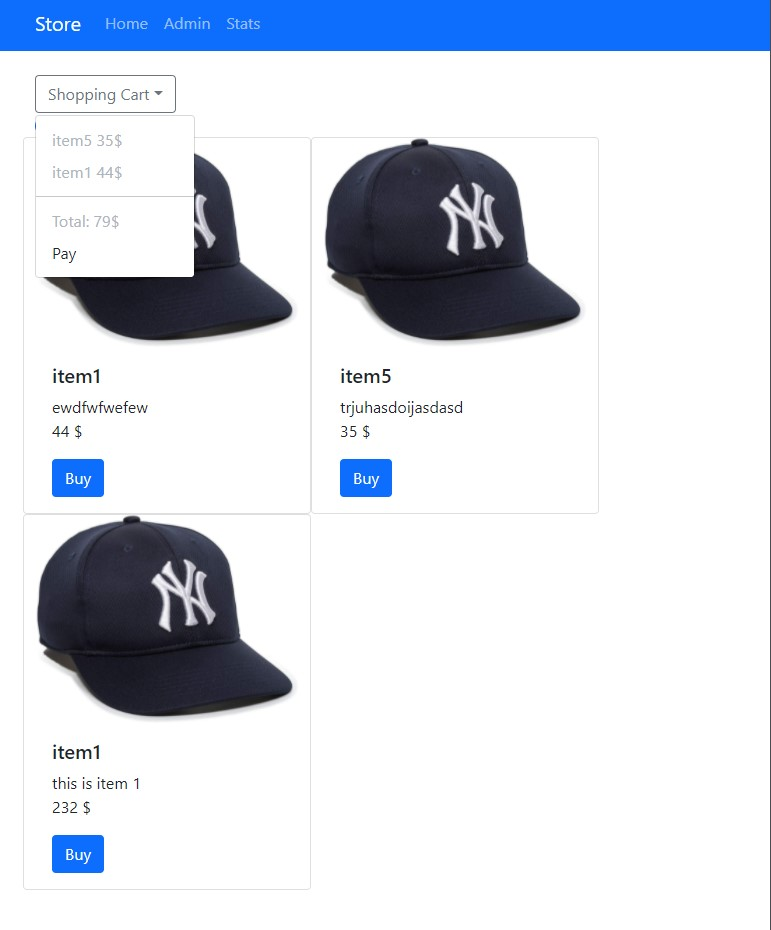
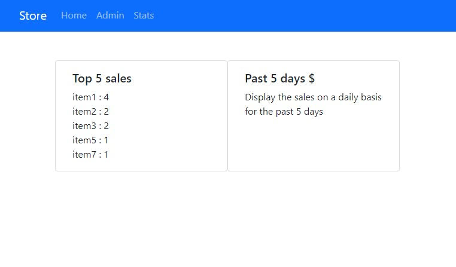

# MERN Ecommerce   

## Description

An ecommerce store built with MERN stack. 

* features:
  * Node provides the backend environment for this application
  * Express middleware is used to handle requests, routes
  * Mongoose schemas to model the application data
  * React for displaying UI components

### Press [here](https://github.com/soferdani/whistassignmentBack) to go to the backend repo 

## Photos

